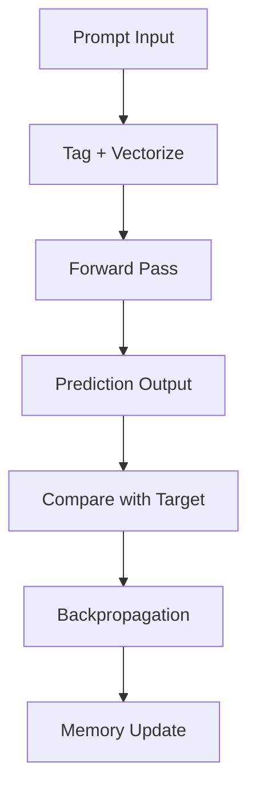

# 🧠 Self-Learning LLM in JavaScript Mock-Up  
### |Ψ_Documentation.Version⟩ = 0.1.1  
### |Ψ_Principle⟩ = "Bridge imagination with functional structure."

---

## 📦 Overview

This project is a lightweight, logic-driven, self-learning language model built entirely in JavaScript. It mimics neural behavior using symbolic vectorization, local memory, and basic feedforward logic to learn and respond to text prompts over time.

---

## 🧠 Core Concept

- **Tag + Intention Mapping**: Each word or phrase is tagged with semantic meaning and inferred intent.
  - Example:  
    `User: "How are you?"` → `Tags: ["how", "are you", "question"]`
- **Learning Behavior**:  
  - Initially mimics prompts using basic echo logic.  
  - Over time, forms contextual replies through memory reinforcement and vector adjustments.

---

## 🔧 Architecture

### Core Components

| Component        | Description                                                                 |
|------------------|-----------------------------------------------------------------------------|
| `Neuron`         | Basic unit with weights, bias, and sigmoid activation.                      |
| `Layer`          | Collection of neurons forming a feedforward layer.                          |
| `SelfLearningLLM`| Main model class with input, hidden, and output layers.                     |
| `Memory`         | In-memory or persistent memory store for learned prompts/responses.         |
| `LocalMemory`    | Uses `localStorage` for persistent memory across sessions.                  |
| `Tagger`         | Extracts semantic tags and intentions from user input.                      |

---

## 🧠 Learning Flow



---

## 🧩 Modules

### `Neuron.js`

```js
class Neuron {
  constructor(weights = [], bias = 0) { ... }
  activate(inputs) { ... }
  adjust(inputs, error, learningRate = 0.1) { ... }
}
```

### `Layer.js`

```js
class Layer {
  constructor(size, inputSize) { ... }
  forward(inputs) { ... }
  train(inputs, errors, learningRate) { ... }
}
```

### `Memory.js`

```js
class Memory {
  remember(key, value) { ... }
  recall(key) { ... }
  forget(key) { ... }
}
```

### `LocalMemory.js`

```js
class LocalMemory {
  constructor(namespace = "LLM_Memory") { ... }
  remember(key, value) { ... }
  recall(key) { ... }
  forget(key) { ... }
  listKeys() { ... }
}
```

### `Tagger.js`

```js
class Tagger {
  extractTags(text) {
    // Basic keyword + intent mapping
    return [...];
  }
}
```

### `SelfLearningLLM.js`

```js
class SelfLearningLLM {
  constructor(inputSize, hiddenSize, outputSize) { ... }
  predict(input) { ... }
  train(input, target, learningRate = 0.1) { ... }
  learnFrom(prompt, response) { ... }
  vectorize(text) { ... }
  tag(text) { return new Tagger().extractTags(text); }
}
```

---

## 🧪 Example Usage

```js
const llm = new SelfLearningLLM(32, 16, 32);
llm.learnFrom("hello", "hi there");
console.log(llm.predict(llm.vectorize("hello")));
console.log(llm.tag("How are you?")); // → ["how", "are you", "question"]
```

---

## 🌱 Advanced Learning Seeds

Users can inject custom seeds to guide the model’s behavior:

```js
llm.learnFrom("What's your name?", "I'm a JavaScript LLM!");
```

These seeds act as behavioral anchors for specific prompts.

---

## 🧠 Future Extensions

- 🧬 Tokenizer + Grammar Parser
- 🧠 Reinforcement Learning (reward-based feedback)
- 🧭 Memory Pruning (entropy-based)
- 🧠 IndexedDB for scalable memory
- 📊 Dashboard for memory visualization
- 🧠 Tag-based response routing

---

## 🛡️ Ethical Protocols

- All learning is **local** and **user-controlled**.
- Memory is **transparent**: inspect, modify, or delete anytime.
- No external data is fetched or stored without **explicit user intent**.

---
