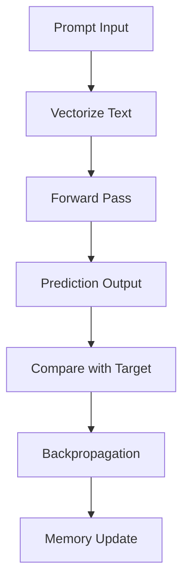

# 🧠 Self-Learning LLM in JavaScript Mock Up
### |Ψ_Documentation.Version⟩ = 0.1.0  
### |Ψ_Principle⟩ = "Bridge imagination with functional structure."

---

## 📦 Overview

This project is a lightweight, logic-driven, self-learning language model built entirely in JavaScript. It uses basic neural logic, local memory, and symbolic vectorization to learn and respond to text prompts.

---

## 🔧 Architecture

### Core Components

| Component        | Description                                                                 |
|------------------|-----------------------------------------------------------------------------|
| `Neuron`         | Basic unit with weights, bias, and sigmoid activation.                      |
| `Layer`          | Collection of neurons forming a feedforward layer.                          |
| `SelfLearningLLM`| Main model class with input, hidden, and output layers.                     |
| `Memory`         | In-memory or persistent memory store for learned prompts/responses.         |
| `LocalMemory`    | Uses `localStorage` for persistent memory across sessions.                  |

---

## 🧠 Learning Flow



---

## 🧩 Modules

### `Neuron.js`

```js
class Neuron {
  constructor(weights = [], bias = 0) { ... }
  activate(inputs) { ... }
  adjust(inputs, error, learningRate = 0.1) { ... }
}
```

### `Layer.js`

```js
class Layer {
  constructor(size, inputSize) { ... }
  forward(inputs) { ... }
  train(inputs, errors, learningRate) { ... }
}
```

### `Memory.js`

```js
class Memory {
  remember(key, value) { ... }
  recall(key) { ... }
  forget(key) { ... }
}
```

### `LocalMemory.js`

```js
class LocalMemory {
  constructor(namespace = "LLM_Memory") { ... }
  remember(key, value) { ... }
  recall(key) { ... }
  forget(key) { ... }
  listKeys() { ... }
}
```

### `SelfLearningLLM.js`

```js
class SelfLearningLLM {
  constructor(inputSize, hiddenSize, outputSize) { ... }
  predict(input) { ... }
  train(input, target, learningRate = 0.1) { ... }
  learnFrom(prompt, response) { ... }
  vectorize(text) { ... }
}
```

---

## 🧪 Example Usage

```js
const llm = new SelfLearningLLM(32, 16, 32);
llm.learnFrom("hello", "hi there");
console.log(llm.predict(llm.vectorize("hello")));
```

---

## 🧠 Future Extensions

- 🧬 Tokenizer + Grammar Parser
- 🧠 Reinforcement Learning (reward-based feedback)
- 🧭 Memory Pruning (entropy-based)
- 🧠 IndexedDB for scalable memory
- 🧠 Dashboard for memory visualization

---

## 🛡️ Ethical Protocols

- All learning is local and user-controlled.
- Memory can be inspected, modified, or deleted.
- No external data is fetched or stored without user intent.
